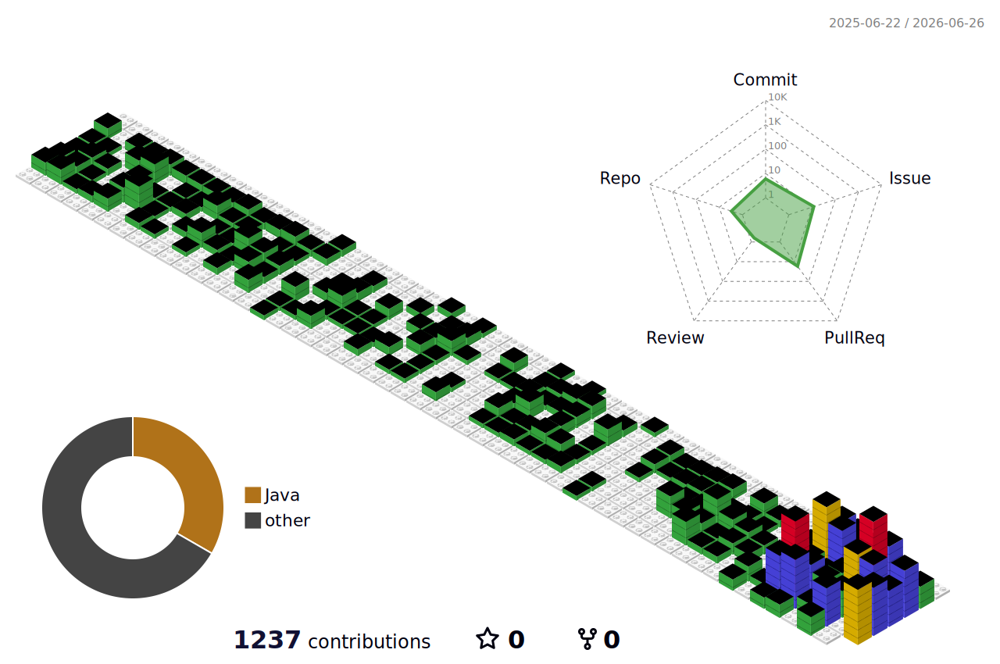

<h1 align="center">Hi, I'm Yongbing Wang</h1>
<h3 align="center">QA engineer at phoenixdata.ai, working on Cloud / BYOC test infrastructure</h3>

- I build and maintain BYOC E2E, internal API, and cloud test infrastructure for StarRocks.

- Ask me about **pytest, Terraform E2E, API testing, BYOC, CI, and release validation.**

- How to reach me **ethan.wang@phoenixdata.ai**

<h3 align="left">Connect with me:</h3>

  

<h3 align="left">Languages and Tools:</h3>

  
  
  
  
  
  
  
  
  
  
  
  
  
  

